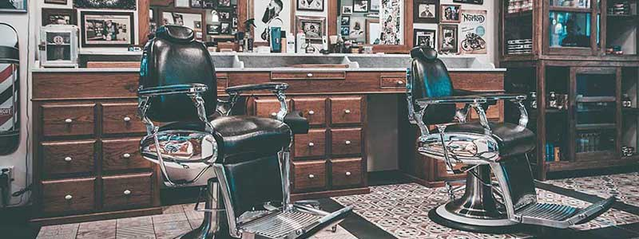

<div align="center">
  

  # Barbearia Taverna

  Site institucional responsivo para apresentação da barbearia, dos serviços oferecidos e dos canais de contato.

  
  
  [](./LICENSE)
</div>



## Sobre o projeto

A **Barbearia Taverna** é um site estático desenvolvido para divulgar o estabelecimento e facilitar o acesso dos clientes às principais informações do negócio. O projeto apresenta a história da barbearia, seus diferenciais, serviços, preços, localização, horários e um formulário de contato.

A interface foi construída com HTML e CSS puros, possui navegação entre páginas e adaptações para dispositivos móveis.

## Funcionalidades

- Página inicial com apresentação da barbearia
- Seção de benefícios e diferenciais
- Mapa com a localização do estabelecimento
- Vídeo incorporado do YouTube
- Catálogo de serviços e preços
- Formulário visual de contato
- Tabela de dias e horários de atendimento
- Layout responsivo para telas menores

## Tecnologias utilizadas

- **HTML5** — estrutura e conteúdo das páginas
- **CSS3** — estilização, transições e responsividade
- **Google Fonts** — fonte Montserrat
- **Google Maps** — mapa incorporado
- **YouTube** — vídeo incorporado

## Estrutura do projeto

```text
barbearia-taverna/
├── index.html          # Página inicial
├── produtos.html       # Serviços e preços
├── contatos.html       # Formulário e horários
├── style.css           # Estilos do site
├── reset.css           # Normalização dos estilos
├── logo.png            # Logo principal
├── logo-branco.png     # Logo usada no rodapé
├── banner.jpg          # Imagem principal
├── cabelo.jpg          # Imagem do serviço de cabelo
├── barba.jpg           # Imagem do serviço de barba
├── cabelo+barba.jpg    # Imagem do pacote completo
├── beneficios.jpg      # Imagem da seção de benefícios
├── utensilios.jpg      # Imagem da seção institucional
├── bg.jpg              # Fundo do rodapé
├── LICENSE             # Licença MIT
└── README.md           # Documentação
```

## Como executar

### Opção 1: abrir no navegador

1. Clone o repositório:

```bash
git clone https://github.com/yago-mascarenhas/barbearia-taverna.git
```

2. Entre na pasta do projeto:

```bash
cd barbearia-taverna
```

3. Abra o arquivo `index.html` no navegador.

### Opção 2: usar um servidor local

Se estiver usando o Visual Studio Code, instale a extensão **Live Server**, clique com o botão direito em `index.html` e escolha **Open with Live Server**.

## Páginas

| Página | Descrição |
|---|---|
| `index.html` | Apresentação, localização e benefícios |
| `produtos.html` | Serviços de cabelo, barba e pacote completo |
| `contatos.html` | Formulário de contato e horários de atendimento |

## Próximas melhorias

- Integrar o formulário a um serviço de envio de mensagens
- Publicar uma demonstração com GitHub Pages
- Melhorar validações e mensagens de retorno do formulário
- Ampliar os recursos de acessibilidade

## Licença

Este projeto está sob a [Licença MIT](./LICENSE).

## Autor

Desenvolvido por [Yago Mascarenhas](https://github.com/yago-mascarenhas).
